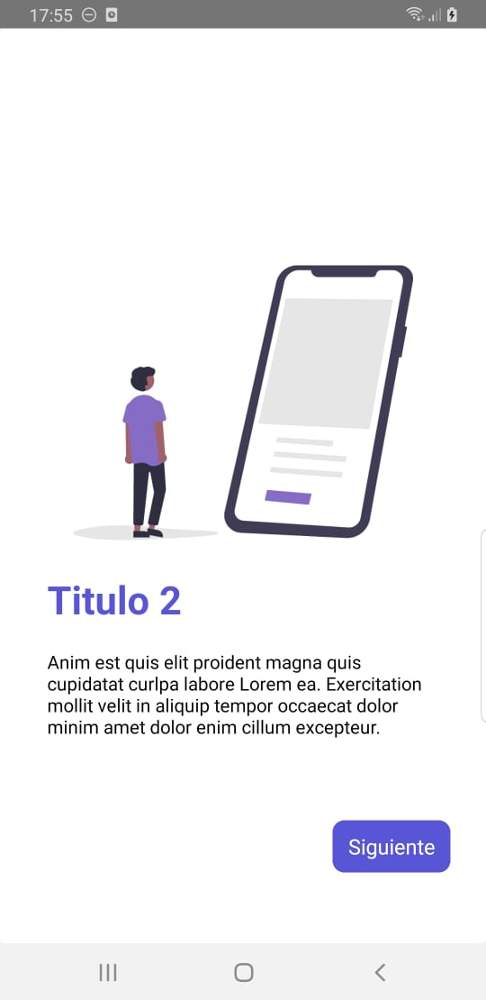

# ComponentsApp

## Descripción
Esta es una aplicación en React Native que utiliza y personaliza diversos componentes de React Native. El objetivo es aprender sobre animaciones, FlatLists, Modals, Alertas, Switches, TextInputs, Teclados, Imágenes y más. Incluye la capacidad de cambiar entre temas claros y oscuros, o crear un tema personalizado. Proyecto del curso de React Native de Fernando Herrera en Udemy.


## Instalación

### Prerrequisitos
- Node.js >= 18
- React Native CLI
- Android Studio (para desarrollo en Android) o Xcode (para desarrollo en iOS)

### Pasos
1. Clona el repositorio:
   ```bash
   git clone https://github.com/tu-usuario/componentsApp.git
   cd componentsApp
2. Instala las dependencias:
   ```bash
   npm install
3. Instala las dependencias:
   ```bash
   npm start
4. Para correr en Android:
   ```bash
   npm run android
5. Para correr en iOS:
   ```bash
   npm run ios

### Uso
- Abre la aplicación en tu emulador o dispositivo.
- Explora los distintos componentes y sus personalizaciones.
- Cambia el tema entre Dark, Light o crea tu propio tema personalizado.

## Capturas de Pantalla

Aquí hay algunas capturas de pantalla de la aplicación en funcionamiento:

### Pantalla Principal

<p align="center">
  
</p>
<p align="center">
  Pantalla principal de la aplicación mostrando los componentes y la pantalla de selección de tema.
</p>

### Ejemplo de Componente

<p align="center">
  
  
  
  
  
  
  
</p>
<p align="center">
   Ejemplos de componentes personalizados en la aplicación.
</p>

## Contacto

Juandi - [GitHub](https://github.com/JuandiAndrade) - [LinkedIn](https://www.linkedin.com/in/juan-diego-andrade-polimeni-1a4501249/) - [juandi.andrade.g@gmail.com](mailto:juandi.andrade.g@gmail.com)
